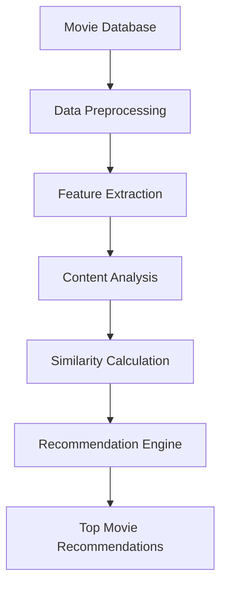

"# movie_recomendation_contentBased" 
## Overview
A content-based movie recommendation system using machine learning techniques.

## Features
- Recommends movies based on content similarity
- Uses natural language processing for description analysis
- Considers multiple movie attributes for recommendations
- Fast and efficient recommendation generation

## Installation
```bash
pip install -r requirements.txt
```

## Usage
```python
python recommend_movies.py --movie "Movie Title"
```

## Technologies
- Python
- Scikit-learn
- Pandas
- NLTK
## System Architecture

## Contributing
Pull requests are welcome. For major changes, please open an issue first.

## License
[MIT](https://choosealicense.com/licenses/mit/)